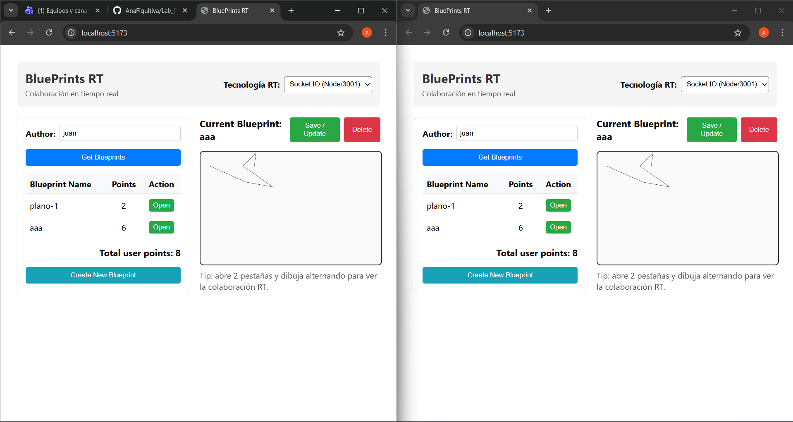

# Laboratorio P4 - BluePrints en Tiempo Real (Sockets & STOMP)

## Informe de Desarrollo

Este proyecto implementa una solución de colaboración en tiempo real para la gestión de planos (BluePrints). La arquitectura permite que múltiples usuarios visualicen y editen el mismo plano de forma simultánea, integrando operaciones CRUD persistentes con un sistema de mensajería bidireccional de baja latencia.

### Integrantes
* **Ana Fiquitiva**

### Evidencia de Funcionamiento

A continuación se muestra una captura de pantalla que demuestra el funcionamiento del sistema en una sesión de colaboración multi-pestaña, donde los trazos realizados en un cliente se replican instantáneamente en el otro:



### Decisiones de Arquitectura

1. **Gestión de Comunicación en Tiempo Real:** 
   Se implementó soporte para protocolos Socket.IO y STOMP. 
   * En **Socket.IO**, se utiliza el modelo de "Rooms" para segmentar el tráfico, donde cada sala corresponde a un plano específico identificado por la tupla `{author}.{name}`.
   * En **STOMP**, se emplean "Topics" dinámicos (`/topic/blueprints.{author}.{name}`) para la suscripción de los clientes.

2. **Segregación de Responsabilidades:**
   * **API REST:** Encargada del ciclo de vida del recurso (Creación, Lectura, Actualización y Borrado).
   * **WebSocket/Sockets:** Especializados exclusivamente en el intercambio de eventos de dibujo (`draw-event`) para maximizar el rendimiento.

3. **Lógica de Frontend:**
   Se desarrolló en React utilizando `useEffect` para la orquestación de conexiones. La visualización se realiza sobre un elemento HTML5 Canvas, optimizado para renderizado incremental de puntos.

### Especificación de Endpoints (API REST)

| Acción | Método | Ruta |
| :--- | :--- | :--- |
| Consulta de Planos por Autor | GET | `/api/blueprints?author={author}` |
| Detalle de Plano | GET | `/api/blueprints/{author}/{name}` |
| Registro de Nuevo Plano | POST | `/api/blueprints` |
| Actualización Persistente | PUT | `/api/blueprints/{author}/{name}` |
| Eliminación | DELETE | `/api/blueprints/{author}/{name}` |

---

## Guía de Configuración y Ejecución

### Requisitos Previos
* Node.js v18+
* Gestor de paquetes npm

### Instalación y Despliegue

1. **Servidor de Mensajería (Backend RT):**
   ```bash
   git clone https://github.com/DECSIS-ECI/example-backend-socketio-node-.git
   cd example-backend-socketio-node-
   npm install
   npm run dev
   ```

2. **Aplicación Cliente (Frontend):**
   ```bash
   cd [directorio-del-proyecto]
   npm install
   npm run dev
   ```

### Verificación de Funcionalidad
Acceder a `http://localhost:5173`, seleccionar el modo **Socket.IO (Node/3001)** y realizar pruebas de concurrencia abriendo navegadores simultáneos con el mismo identificador de autor.

---
© 2026 - Escuela Colombiana de Ingeniería Julio Garavito.
